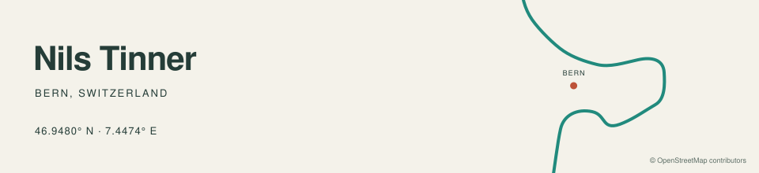

I'm Nils, a climate scientist from Bern, now working at Ubique. I completed my MSc in Climate Sciences at the University of Bern and ETH Zurich.

I work with weather stations, maps and machine learning to understand urban heat. My master's thesis modelled air temperatures across European cities. I also build small tools for local weather questions.

[Bernometer](https://bernometer.unibe.ch/) maps live temperatures and local heat forecasts in Bern. A closer look at how warm it gets between the official weather stations.

[Morlongo Forecast](https://github.com/tinnern/morlongo-forecast) uses measurements from a local station to correct weather forecasts for Morlongo.

I can explain the heat. I still complain about it.

[LinkedIn](https://www.linkedin.com/in/nils-tinner-289942265/)
